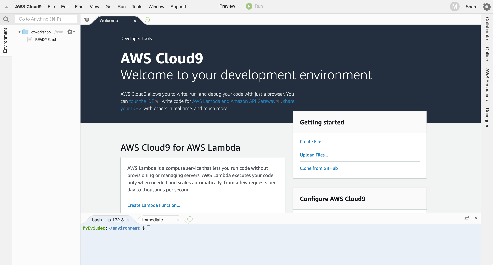

# Setup AWS Cloud9

In this lab you will configure a working environment for the 2 initial labs. By the end of the module you will:

* Have an operational integrated development environment (IDE) usable by the 2 initial labs. This will include the base AWS Cloud9 instance along with installation of all dependencies.
* Know how to interact with the IDE via a web browser, upload or download files between it and your local workstation/laptop.
* Know how to pause and restart the instance as-needed if unused for a period of time to save costs.
* Understand why reproducible environments such as AWS Cloud9 can reduce errors and provide consistency to architecting and development efforts.

Why should you use a cloud-based IDE when you have a powerful computer right in front of you? Developing workloads normally requires installation and management of development tools such as languages, compilers, and other specific tools. It is common that when going though workshops over time, your local computer or laptop will have multiple versions of languages, such as Python 2.7, 3.6, 3.7, and 3.8, each with a different set of packages. This is also true for other applications.

Or, your laptop may be running one operating system such a macOS Mojave (or Catalina), while the person next to you is running Windows 10 (or 7, or 8), and the person on the other side you is running some version of Linux. So by setting up and using a common IDE, which also includes a common operating system, the other lab instructions can be completed without having to spend time installing or resolving issues. IDE hygiene!

> [!NOTE]
> If you do wish to use your own laptop, review the [Install All Lab Dependencies](/0-lab-setup/1-setup-cloud9?id=_2-install-all-lab-dependencies) step below to ensure you have the same ones installed and available on your laptop.

## 1. Create a new Cloud9 IDE Instance

From the AWS Console, navigate to Cloud9, select the region you will be working in for the 2 initial labs, then create a new environment with the following environment settings:

1. Sign in to the AWS Management Console and open the Cloud9 console at https://console.aws.amazon.com/cloud9/
2. From the upper right on the menu bar, select the region drop-down and set to the region where you will be running all the labs. We will use Ireland, or eu-west-1 during lab examples
3. From the Cloud9 page, choose on **Create environment**
4. Fill out the **Name** box with *iotworkshop* and optionally the **Description**, then choose **Next step:**
5. Under Environment settings left the default values, choose **Next step:**
6. Review the values, choose **Create environment**. This will change to the IDE window, and after a couple minutes the IDE will appear similar to this:

7. Close the Welcome tab and launch a New terminal tab in its place

## 2. Install All Lab Dependencies

To complete the 2 initial labs, there may be additional software or configuration changes required. The Command Input below will go through and perform these installations.

```bash
### For copying, include this line

# Install dependencies
sudo yum -y install jq

# Create openssl.cnf file
cat <<EOT >> ~/openssl.cnf
[req]
distinguished_name=dn
[ dn ]
countryName			= Country Name (2 letter code)
countryName_default		= ES
countryName_min			= 2
countryName_max			= 2
stateOrProvinceName		= State or Province Name (full name)
stateOrProvinceName_default	= Some-State
localityName			= Locality Name (eg, city)
0.organizationName		= Organization Name (eg, company)
0.organizationName_default	= IoT power SA
organizationalUnitName		= Organizational Unit Name (eg, section)
commonName			= Common Name (e.g. server FQDN or YOUR name)
commonName_max			= 64
emailAddress			= Email Address
emailAddress_max		= 64
[ ext ]
basicConstraints=CA:TRUE,pathlen:0
EOT

echo "********* Your Cloud9 IDE is ready for use"
### For copying, include this line
```

Now you have the IDE needed for the 2 initial labs.
