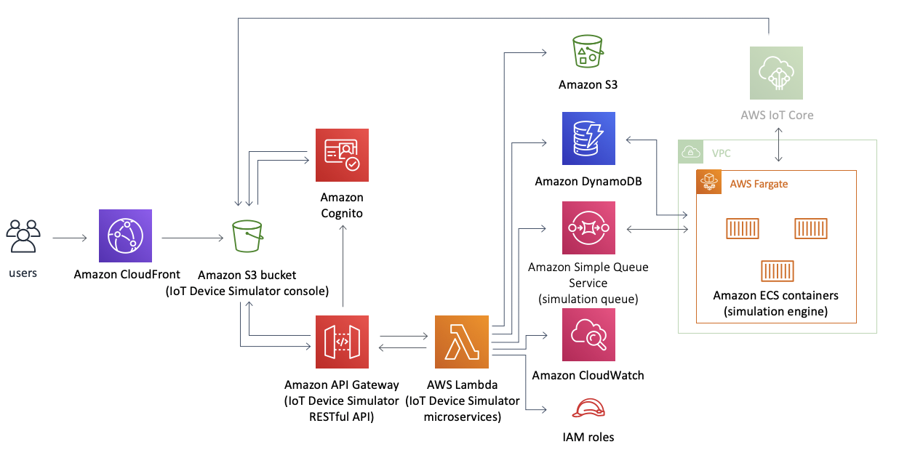

# Deploy IoT Device Simulator

In order to facilitate the the creation of simulated IoT devices we will used a solution designed by AWS, [IoT Device Simulator](https://aws.amazon.com/solutions/implementations/iot-device-simulator/).

This solution provides a web-based graphical user interface (GUI) console that enables customers to create and simulate hundreds of virtual connected devices, without having to configure and manage physical devices, or develop time-consuming scripts.

The diagram below presents the architecture you will deploy using the AWS CloudFormation template.

## 1. Deploy the CloudFormation

1. Sign in to the AWS Management Console and click the button to launch the iot-device-simulator AWS CloudFormation template.

2. The template launches in the EU West (Ireland), we will use this Region for the labs.
3. On the **Select Template** page, verify that you selected the correct template and choose **Next**.
4. On the **Stack name** text box, assign a name to your solution stack, *iot-device-simulator*.
5. Under **Parameters**, review the parameters for the template and fill them:
  1. Introduce an **Administrator Name**.
  2. Introduce a valid email, you will need to validate it, **Administrator email address**.
6. Choose **Next**.
7. On the Options page, choose **Next**.
8. On the Review page, review and confirm the settings. Check the box acknowledging that the template will create AWS Identity and Access Management (IAM) resources.
9. Choose Create to deploy the stack.
You can view the status of the stack in the AWS CloudFormation console in the **Status** column. You should see a status of **CREATE_COMPLETE** in approximately 10 minutes.

After setup, the solution sends the administrator an email invitation to join the IoT Device Simulator web console.

10. In the email, follow the instructions to sign in to the web console
