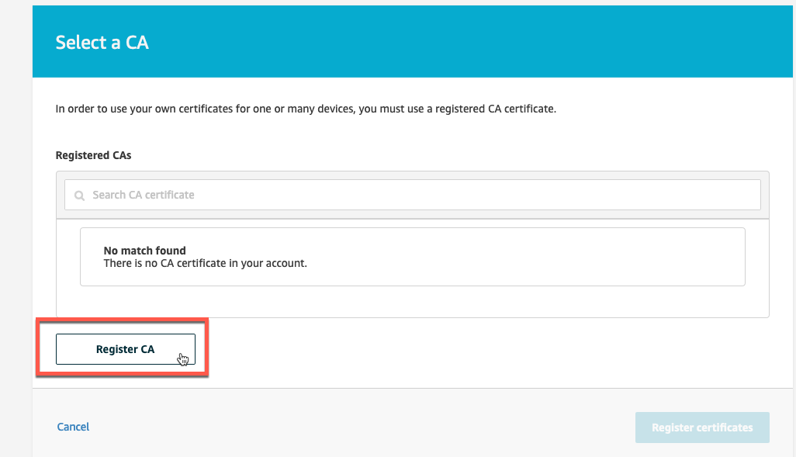

# Create your own CA

In this lab you setup your very own Certificate Authority (CA) to issue device certificates that can be registered by AWS IoT. By the end of this lab you will:

  * Understand how to create an offline CA used to create device certificates.
  * How to use the AWS Console to register your CA with AWS IoT and a trusted issuer of certificates.
  * Be able to navigate in the AWS Console to view the status of the CA and issued certificates.


## 1. Obtain a New Private Root CA Registration Code

1. From the AWS Console, navigate to AWS IoT Core->**Secure**->**CAs**->**Register a CA** (if you don’t have any, otherwise Register).


2. From the Select a CA page, click on **Register CA** to start the process of creating and validating a new CA.



3. From the **Register a CA Certificate** page, this will show the steps needed to register the new CA. We won’t use these exact steps, but the registration code is needed to sign a certificate to verify CA ownership. Copy the **registration code** to a temporary location.


> [!DANGER]
> Reminder! Keep this browser open, you will come back to it to enter the CA and verification certificates.

## 2. Create Your Local Root CA


A root or issuing CA is normally stored and accessed from a controlled location. For this lab, you will create a *root CA* in your home directory. This will also be the location where all related files are created.

Use OpenSSL to create a private key that will be used for the root CA. Once complete, use OpenSSL to create a self-signed root CA certificate with the <mark>openssl.cnf</mark> configuration file that will add the needed extensions to work with AWS IoT. When done you will have a private key file named <mark>rootCA.key</mark> and the corresponding root certificate named <mark>rootCA.pem</mark>.

1. From the Cloud9 terminal, generate a private key file with a 4096-bit RSA key:

**Command Input:**

```bash
openssl genrsa -out rootCA.key 4096
```
**Command Output:**

```bash
Generating RSA private key, 4096 bit long modulus
.................++
....................................................................................++
e is 65537 (0x10001)
```

2. Now use the private key to create a self-signed root CA certificate. By being self-signed, this is certificate that will be used to verify control to AWS IoT:

**Command Input:**

```bash
openssl req -x509 \
        -new \
        -nodes \
        -key rootCA.key \
        -sha256 \
        -days 1024 \
        -out rootCA.pem \
        -config openssl.cnf \
        -extensions ext
```
Interactive Command Output, enter **Common Name** value of *My Test CA* on highlighted line:

```bash
You are about to be asked to enter information that will be incorporated
into your certificate request.
What you are about to enter is what is called a Distinguished Name or a DN.
There are quite a few fields but you can leave some blank
For some fields there will be a default value,
If you enter '.', the field will be left blank.
-----
Country Name (2 letter code) [ES]:
State or Province Name (full name) [Some-State]:
Locality Name (eg, city) []:
Organization Name (eg, company) [IoT power SA]:
Organizational Unit Name (eg, section) []:
Common Name (e.g. server FQDN or YOUR name) []:My Test CA
Email Address []:
```

## 3. Generate and sign the Verification Certificate

With the root CA created locally, now use the registration code obtained from the AWS Console to create and sign the verification certificate. The registration code will be the value for the Common Name of the certificate. By creating a certificate request with this common name value, and by having it signed by the root CA, these two components validate ownership to AWS IoT. Follow these steps:

1. Generate a private key to be used for verification certificate.

**Command Input:**

```bash
openssl genrsa -out verificationCert.key 2048
```

**Command Output:**

```bash
Generating RSA private key, 2048 bit long modulus
............+++
....+++
```
2. Create the certificate signing request (CSR) using the registration code as the Common Name

**Command Input:**

```bash
openssl req -new -key verificationCert.key -out verificationCert.csr
```

Interactive Command Output, for the **Common Name** field, replace with your *registration code*, press enter for all others to accept defaults:

```bash
You are about to be asked to enter information that will be incorporated
into your certificate request.
What you are about to enter is what is called a Distinguished Name or a DN.
There are quite a few fields but you can leave some blank
For some fields there will be a default value,
If you enter '.', the field will be left blank.
-----
Country Name (2 letter code) [ES]:
State or Province Name (full name) [Some-State]:
Locality Name (eg, city) []:
Organization Name (eg, company) [IoT power SA]:
Organizational Unit Name (eg, section) []:
Common Name (e.g. server FQDN or YOUR name) []:b47bxxxxxxxxxxxxxxxxxxxxxxxxxxxxxxxxxxxxxxxxx97edc
Email Address []:

Please enter the following 'extra' attributes
to be sent with your certificate request
A challenge password []:
An optional company name []:

```

3. Use the CSR file (verificationCert.csr) and create the verification certificate using the root CA. This will create the fully signed verificationCert.crt file.

**Command Input:**

```bash
openssl x509 \
    -req \
    -in verificationCert.csr \
    -CA rootCA.pem \
    -CAkey rootCA.key \
    -CAcreateserial \
    -out verificationCert.crt \
    -days 500 \
    -sha256
```

**Command Output** (CN= value will be your unique registration code):

```bash
Signature ok
subject=/C=ES/ST=Some-State/O=IoT power SA/CN=b47bxxxxxxxxxxxxxxxxxxxxxxxxxxxxxxxxxxxxxxxxx97edc
Getting CA Private Key
```
