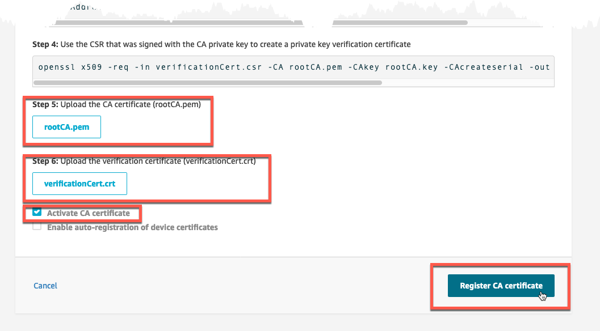
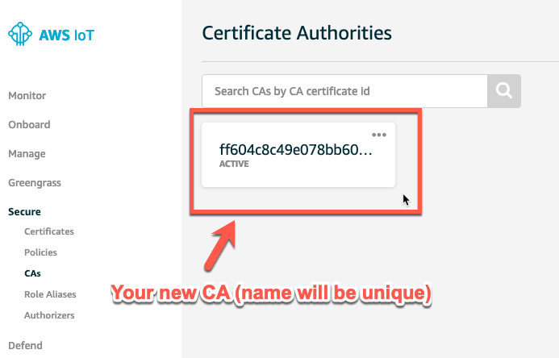

# Deploy your own CA

With the root CA and verification certificate created locally, go back to your web browser where we left off the CA creation process. Here, select the <mark>rootCA.pem</mark> file, and the <mark>verificationCert.crt</mark> file. Then check the Activate CA Certificate and finally click on Register CA certificate. This will complete the process and return to the list of registered CA’s, now including this one!

> [!NOTE]
> The location of <mark>rootCA.pem</mark>  and <mark>verificationCert.crt</mark> files need to be local to your web browser. If using Cloud9, you will need to download the files locally (navigate to the files from the left pane then right-click on each file and download to your laptop or workstation).

## 1. Complete the Registration of Your Root CA and Activate

1. From the browser, click and complete the <mark>rootCA.pem</mark> file, the <mark>verificationCert.crt</mark> file, and check Activate CA Certificate. When done, finally click on Register CA certificate.

2. When successfully completed, you will return to the list of registered CA’s, including this one!

###  Outcomes

By creating and validating a CA in AWS IoT, you now have a method to generate device certificates to meet your specific needs, and can do so without having to interact with AWS IoT services directly.

Also, the same CA can be registered in multiple regions by going through the registration process above for each region. This allows for a device to have a single certificate that can be presented to different AWS regions.
