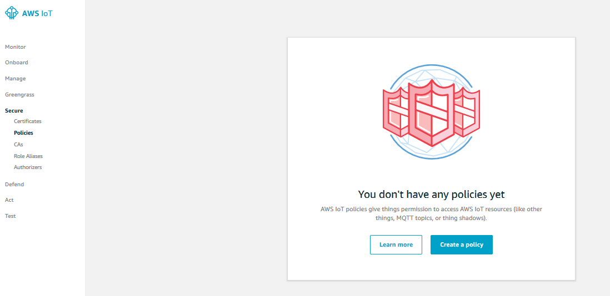
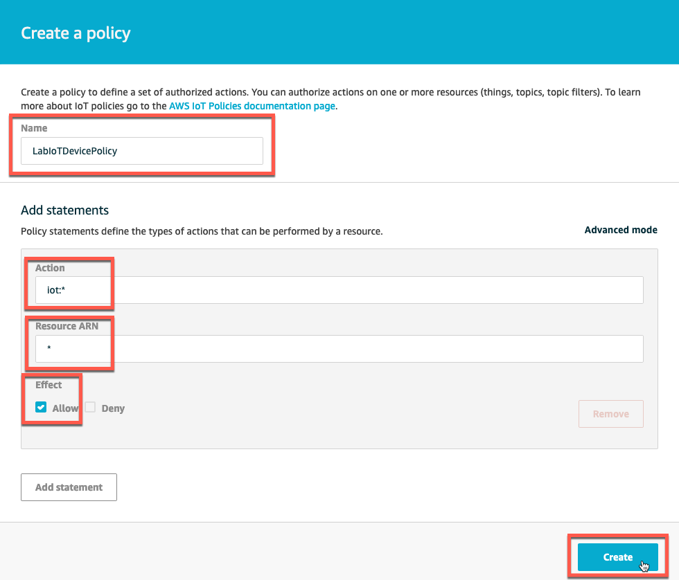
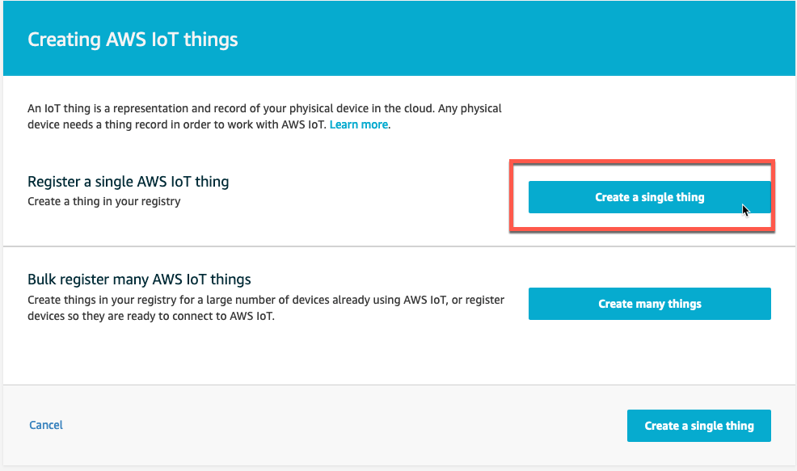
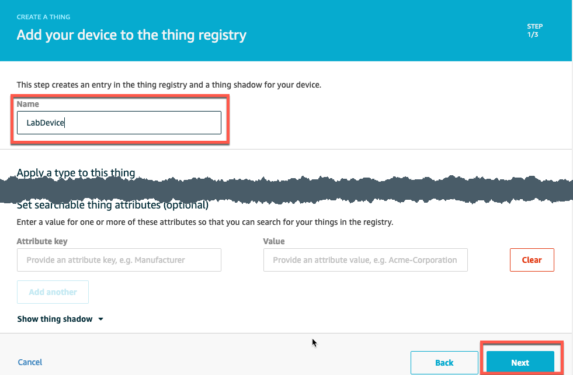
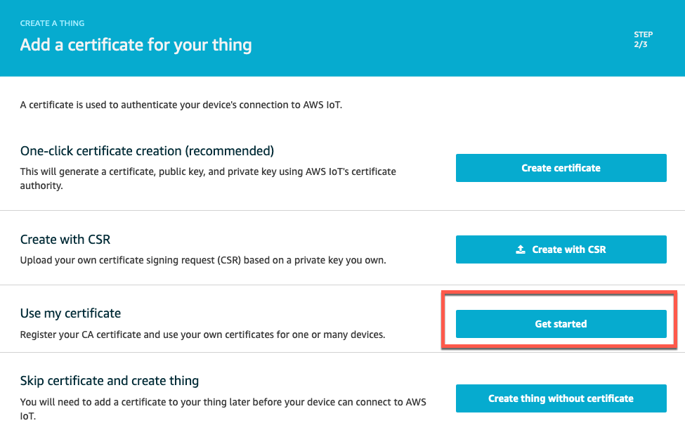
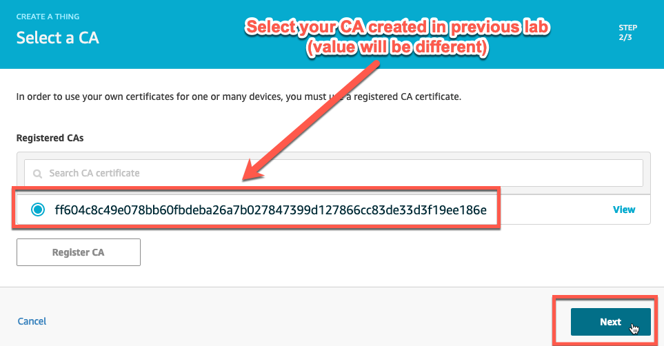
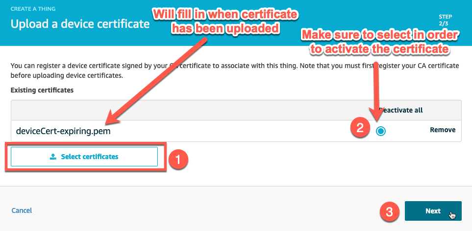
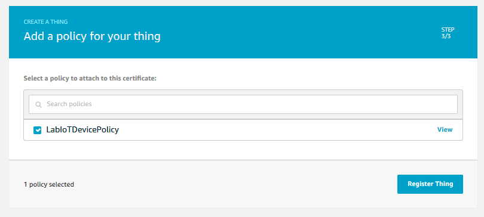

# Generate Device certificates from your CA

Now that you have your own Certificate Authority (CA) registered, in this lab you will see how it can be used to generate and register device certificates. By the end of this lab you will:

* Understand the steps taken to generate and register a new device certificate via the AWS Console.
* Set attributes on a certificate that can be used by AWS IoT services to enforce policy and lifetime of certificates.

### Dependencies
You need to have successfully completed the Bring Your Own CA lab and have:

* Registered the CA in AWS IoT Core.
* An open terminal in the directory where your CA files are located, either in Cloud9 or on your local system.


## 1. Generate a Device Certificate from Your Own CA

1. Make sure you are in the directory where the <mark>rootCA.pem</mark> file, your CA, is located.

2. Create a private key for the device certificate.

**Command Input:**

```bash
openssl genrsa -out deviceCert-expiring.key 2048
```

**Command Output:**

```bash
Generating RSA private key, 2048 bit long modulus
...................................................+++
.................................................................+++
e is 65537 (0x10001)
```

3. Use the private key to create a certificate signing request. This will contain the details that the CA will attest during the signing operation. You can hit Enter to use the defaults, and enter **test-device** for the Common Name field.

**Command Input:**

```bash
openssl req -new -key deviceCert-expiring.key -out deviceCert-expiring.csr
```

Interactive Command Output, enter *Common Name* value of **test-device**:

```bash
You are about to be asked to enter information that will be incorporated
into your certificate request.
What you are about to enter is what is called a Distinguished Name or a DN.
There are quite a few fields but you can leave some blank
For some fields there will be a default value,
If you enter '.', the field will be left blank.
-----
Country Name (2 letter code) [ES]:
State or Province Name (full name) [Some-State]:
Locality Name (eg, city) []:
Organization Name (eg, company) [IoT Power SA]:
Organizational Unit Name (eg, section) []:
Common Name (e.g. server FQDN or YOUR name) []: test-device
Email Address []:

Please enter the following 'extra' attributes
to be sent with your certificate request
A challenge password []:
An optional company name []:
```

4. Sign (generate) the device certificate with your CA, setting the certificate expiration date to be 10 days from now.

**Command Input:**

```bash
openssl x509 -req -in deviceCert-expiring.csr -CA rootCA.pem -CAkey rootCA.key -CAcreateserial -out deviceCert-expiring.pem -days 10 -sha256
```

**Command Output:**

```bash
Signature ok
subject=/C=test-device/L=Default City/O=IoT Power SA
Getting CA Private Key
```

5. Download the <mark>deviceCert-expiring.pem</mark> file to your local system where you have a browser opened to the AWS Console. You will use your local browser to upload the certificate in a later step.

## 2. Configure an IoT Policy

Device certificates are associated with an IoT Policy when registered with AWS IoT Core. If you don’t have one, create a new AWS IoT Policy named *LabIoTDevicePolicy* with the Action of **iot:*** and a *Resource ARN* of *****, and Effect of **Allow**.

1. From the AWS Console, navigate to AWS IoT Core->**Secure**->**Policies** and click on **Create a policy**.



2. Complete the form with the following:

* **Name:** LabIoTDevicePolicy
* **Action:** iot:*
* **Resource ARN:** *
* **Effect:** Allow



3. Then click **Create** to complete the policy creation.

## 3. Create a New AWS IoT Thing Using the Expiring Certificate and Policy

1. From the AWS Console, navigate to AWS IoT Core->**Manage**->**Things** and click **Register a thing**
2. Click **Create a single thing**.



3. Complete the Create A Thing form with Name *LabDevice* and then click Next.



4. To use your newly created certificate, click on **Get started**.



5. Select the CA you created in the previous lab, then click Next.



6. Click on Select certificates and upload the <mark>deviceCert-expiring.pem</mark> file, then click **Next**.



7. Finally select the Policy created earlier and click **Register Thing** to complete the process.



> [!NOTE]
> At this point, you have created a Policy, a Thing, uploaded the certificate, and associated all of them together. Nice!

## 4. Verify the Certificate Can Be Used to Connect and Send Messages

From Cloud9, issue the following command to verify the certificate can send a message via AWS IoT. Replace the **<AWS IoT Endpoint>** section with your endpoint.

**Command Input:**

```bash
# Download the root CA
wget https://www.amazontrust.com/repository/AmazonRootCA1.pem
# Obtain the IoT endpoint fully qualified domain name
aws iot describe-endpoint --endpoint-type iot:Data-ats
```
Replace **<AWS IoT Endpoint>** with the value of **"endpointAddress"** in the following command
```bash
curl --tlsv1.2 --cacert AmazonRootCA1.pem --cert deviceCert-expiring.pem --key deviceCert-expiring.key -X POST -d "{ \"message\": \"Hello, world\" }" "https://<AWS IoT Endpoint>:8443/topics/my_first_topic?qos=1"
```

**Command Output:**

```bash
{"message":"OK","traceId":"15b58137-ce24-8176-154f-043f76b7fd22"}username:~ $
```

The **"message":"OK"** response indicates that the message was correctly sent. You can also go to the console, AWS IoT->Test->Subscription topic and subscribe to **my_first_topic** and then run the same curl command again. You should see the message posted in the console MQTT client.

### Outcomes

By using a local CA, you now can create processes to generate and issues certificates for your things. You can also see how certificates can be generated with specific details such as expiration dates to limit what can be done with certificates.
