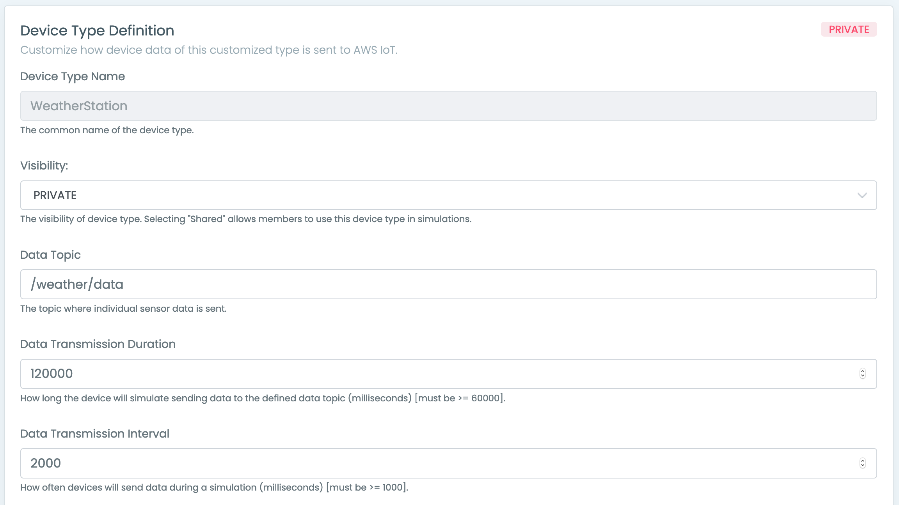
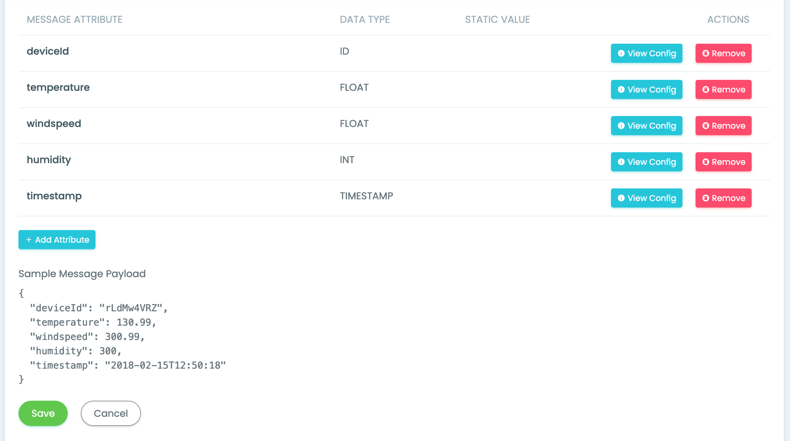
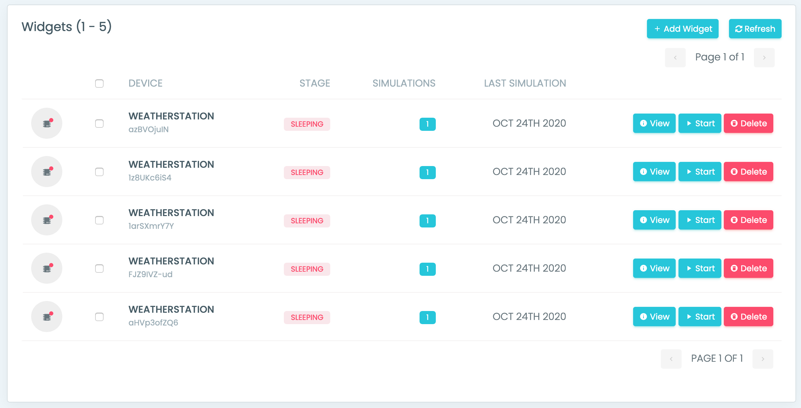

# IoT Device Simulator

### Dependencies
You need to have successfully completed [Deploy IoT Device Simulator](0-lab-setup/2-deploy-iot-simulator.md) on **Lab Setup** section and have:

* Access to the email invitation and URL to log in the AWS IoT Device Simulator deployed.

### Access the IoT Device Simulator

After the solution has been deployed, sign in to the IoT Device Simulator web console using the link in the email invitation you receive. When you sign in to the web console for the first time, use the temporary password that is included in the email invitation. You are prompted to change your password after successful authentication.

## 1. Create a weather station device type

Use the following procedure to create a weather station device type.

1. Sign in to the IoT Device Simulator console and choose **Device Types**.
2. Select **+ Add Device Types**.
3. In the **Device Type Definition** section, enter the following information:
  * For Device Type Name, enter WeatherStation.
  * For Visibility, enter private.
  * For Data Topic, enter /weather/data.
  * For Data Transmission Duration, enter 120000.
  * For Data Transmission Interval, enter 2000.

4. Under **Message Payload**, select **Add Attribute**.
5. In the **Message Attribute** window, enter the following information:
  * For **Attribute Name**, enter *deviceId*.
  * For **Attribute data type**, enter **DEVICE ID**.
6. Select **Submit**.
7. Repeat steps 4 – 6 to create the following attributes:
  * **Attribute Name**: temperature
    * **Attribute data type**: FLOAT
    * **Float precision**: 2
    * **Integer minimum value**: 30
    * **Integer maximum value**: 130
    * **Decimal precision minimum value**: 0
    * **Decimal precision maximum value**: 99
  * **Attribute Name**: windspeed
    * **Attribute data type**: FLOAT
    * **Float precision**: 2
    * **Integer minimum value**: 0
    * **Integer maximum value**: 300
    * **Decimal precision minimum value**: 0
    * **Decimal precision maximum value**: 99
  * **Attribute Name**: humidity
      * **Attribute data type**: INTEGER
      * **Minimum value**: 0
      * **Maximum value**: 300
  * **Attribute Name**: timestamp
      * **Attribute data type**: UTC TIMESTAMP
      * **Timestamp format**: Default (YYYY-MM-DDTHH:mm:ss)

8. Select **Save**.

## 2. Create weather station widgets

Use this procedure to create 5 weather station widgets.

1. On the IoT Device Simulator console page, in the navigation pane, choose **Widgets**.
2. Select **+ Add Widgets**.
3. In the **Create a widget** window, enter the following information:
  * For **Device Type**, select **WeatherStation**.
  * For **Number of widgets**, enter *5*.
  4. Select **Submit**.

The solution provisions 5 weather station widgets and starts sending simulated data for those widgets to the AWS IoT topic */weather/data*.

## 3. View the simulated data

You can view simulated IoT Device Simulator data in the device simulator web console or in the AWS IoT console.

### IoT Device Simulator web console

To view simulated data in the solution web console, use the following procedure:

1. On the IoT Device Simulator console page, in the navigation menu, select **Widgets**.
2. On the **Device Widgets** page, find a weather station widget with a **Stage** value of **RUNNING**.
3. Select **View**.
The simulated data will be displayed.

> [!INFO]
> If none of the weather station widgets have a **Stage** value of **RUNNING**, select **Start** next to any weather station widget to start a simulation. Then, select **View** to view the simulated data for the running widget.

### AWS IoT web console

To view simulated data in the AWS IoT web console, use the following procedure:

1. Navigate to the [AWS IoT console.](https://console.aws.amazon.com/iot/home)
2. In the navigation pane, choose **Test**.
3. For Subscription topic, enter */weather/data*.
4. Select **Subscribe to topic**.

> [!INFO]
>If the data is not displayed, verify that a simulation is running. In a separate browser window, navigate to the **Device Widgets** page in the IoT Device Simulator web console. Select **Start** next to any weather station widget to start a simulation. Check the */weather/data* topic in the AWS IoT console. 
