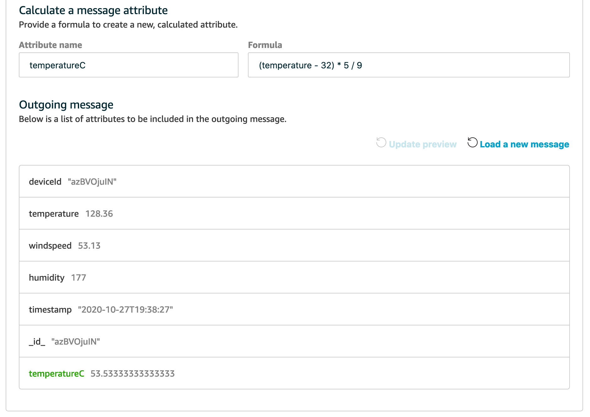

# Ingest data to IoT Analytics

### Objectives

In this workshop, you will build a solution that helps you perform analytics on the weather stations. You will configure AWS IoT Core to ingest stream data from AWS IoT devices and build an analytics pipeline using AWS IoT Analytics.

### Dependencies

You need to have successfully completed [Deploy IoT Device Simulator](0-lab-setup/2-deploy-iot-simulator.md) on **Lab Setup** section, [Create a weather station](3-device-simulator/1-device-simulator.md) on **Lab Setup** section and have:

* Access to the email invitation and URL to log in the AWS IoT Device Simulator deployed.
* Access to the simulated data created by the weather stations

## 1. Create Stream Analytics Pipeline

### Create Channel

On the AWS IoT Analytics console home page, in the left navigation pane, choose **Channels**:

1. Click Create
2. Channel ID - **workshop_channel**
3. Choose Storage Type - **Service-managed store** (Keep all other options default , click **Next**)
4. IoT Core topic filter - **/weather/data**
5. IAM role name - Create new -> Enter role name **weatherdevice_role**
6. **Create Channel**

### Create Data store

On the AWS IoT Analytics console home page, in the left navigation pane, choose **Data stores**:

1. Click **Create**
2. ID - **workshop_store**
3. Choose Storage Type - **Service-managed store** (Keep all other options default)
4. Click **Create data store**

### Create Pipeline

On the AWS IoT Analytics console home page, in the left navigation pane, choose **Pipeline**:

1. Click **Create**
2. Pipeline ID - **workshop_pipeline**
3. pipeline source - **workshop_channel**. Click Next
4. Set attributes of messages - You should see incoming messages here. Click **Next**
  * Select all attributes to be stored.
5. Add activity - **Calculate a message attribute**
  * Attribute Name: **temperatureC**
  * Formula: (temperature - 32) * 5 / 9
6. Click **update preview** -> **temperatureC** field should appear in outgoing message, click **Next**

7. Pipeline output - Click edit and choose **workshop_store**
8. Click Create pipeline

Now we have created the IoT Analytics Pipeline to let us analyze the data.

### Create Data sets

On the AWS IoT Analytics console home page, in the left navigation pane, choose **Data sets**:

1. Click **Create** -> SQL Data sets -> Create SQL
2. ID - **workshop_dataset**
3. Data store source - **workshop_store** , Click **Next**
4. SQL Query - Keep the default
5. Data Selection Window - **None**
6. On the next screen, set the query schedule to refresh the dataset **Every 1 min**
7. Leave rest of the options as default and **Create data set**

Now lets execute the dataset:

1. Datasets -> **workshop_dataset** -> **Actions** -> **Run now**
2. Wait for few mins for the results to appear in the Result preview section of the screen.
3. If there are no results in Result preview pane , re-run the dataset again.

### Outcomes

In this lab , you created an end to end data pipeline using IoT Analytics to store, process and analyze time series data generated from the IoT devices created
