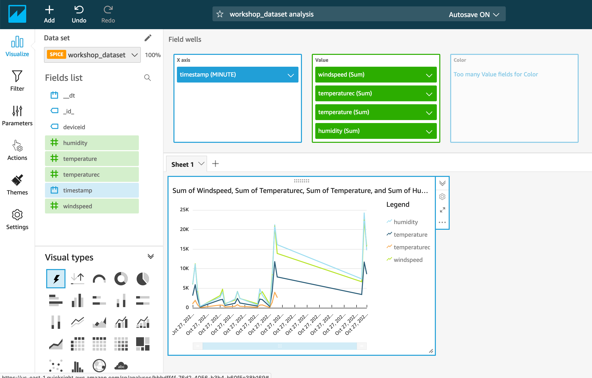

# Visualise data in QuickSight

### Dependencies

You need to have successfully completed [Ingest data to IoT Analytics](4-analytics/1-analytics.md)

## 1. Visualize the time series data using charts & bars

In this lab you will use Amazon QuickSight to visualize all the data collected so far using charts & bars.

1. Go to the AWS Console and select **AWS QuickSight** -
  * Enroll for standard edition (if you have not used it before)
  * Click on your login user (upper right) -> **Admin** -> **Manage QuickSight** -> **Security & Permissions** -> **Add and Remove** -> **Check IoT Analytics** -> **Apply**
  * Click on QuickSight logo (upper left) to navigate to home page
  * Change the region to your working region (N. Virginia)
2. Select **New Analysis** -> **New data set** -> Choose **AWS IoT Analytics**
3. Enter Data source name -> workshop-dashboard
4. Select an AWS IoT Analytics dataset to import - workshop_dataset
5. Create data source -> **Visualize**
6. Determine the home energy consumption -
  * Choose **timestamp** for X axis (Choose **MINUTE** from Value drop down)
  * Choose temperature, temperaturec, humidity and windspeed readings for Y-axis.

The graphs may look similar to the one below.

Feel free to play with different fields or visual types for visualizing other smart home related information.

### Outcome

In this lab you created BI dashboards using Amazon QuickSight, on the data stored in IoT Analytics data store, to be leveraged by Business users in visualizing different metrics, in a single pane of glass view.
