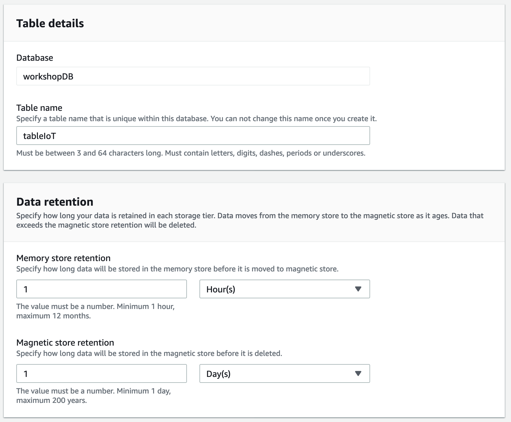

# Ingest IoT data to a TimeStream Database


### Objectives

In this workshop, you will build a solution that helps you store IoT information in a Time series Database. You will configure AWS IoT Core to ingest stream data from AWS IoT devices to a TimeStream Database

Amazon Timestream is a fast, scalable, fully managed, purpose-built time series database that makes it easy to store and analyze trillions of time series data points per day. Timestream saves you time and cost in managing the lifecycle of time series data by keeping recent data in memory and moving historical data to a cost optimized storage tier based upon user defined policies.

### Dependencies

You need to have successfully completed [Deploy IoT Device Simulator](0-lab-setup/2-deploy-iot-simulator.md) on **Lab Setup** section, [Create a weather station](3-device-simulator/1-device-simulator.md) on **Lab Setup** section and have:

* Access to the email invitation and URL to log in the AWS IoT Device Simulator deployed.
* Access to the simulated data created by the weather stations


## 1. TimeStream database and table creation

### Create a database

Follow these steps to create a database using the AWS Console:

1. Open the [AWS Console for TimeStream](https://console.aws.amazon.com/timestream)
2. In the navigation pane, choose **Databases**
3. Click on **Create database**.
4. On the create database page, enter the following:
  * **Choose configuration** – Select **Standard database**.
  * **Name** – Enter *workshopDB*.
  * **Encryption** – Choose a KMS key or use the default option, where Timestream will create a KMS key in your account if one does not already exist.
5. Click on **Create database** to create a database.


### Create a table

Follow these steps to create a table using the AWS Console:

1. Open the [AWS Console for TimeStream](https://console.aws.amazon.com/timestream)
2. In the navigation pane, choose **Tables**
3. Click on **Create table**.
4. On the create table page, enter the following:
  * **Database name** – Select *workshopDB*.
  * **Table name** – *tableIoT*.
  * **Memory store retention** – **1 Hour(s)**
  * **Magnetic store retention** – **1 Day(s)**



5. Click on **Create table**.

## 2. IoT Rule creation

In order to ingest data from IoT Core to TimeStream we will use IoT Rules for that purpose.

1. Open the [AWS Console for IoT](https://console.aws.amazon.com/iot)
2. In the navigation pane, choose **Act** -> **Rules**
3. On the create a rule page, enter the following:
  * **Name** - *IoTrule*
  * **Description**(optional) - *IoT rule to ingest data to TimeStream*
4. On the **Rule query statement** modify the topic - ```SELECT * FROM '/weather/data'```
5. On the **Set one or more actions**, Click on **Add action**
6. Choose **Write a message into a TimeStream table**, Click on **Configure action**
7. On the **Configure action** page, enter the following:
  * **Database name** – Select *workshopDB*.
  * **Table name** – *tableIoT*.
8. On **Dimensions**, enter the following:
  *  **Dimension Name** - *deviceId*,  **Dimension Value** - *${deviceId}*, Click **Add another**
  *  **Dimension Name** - *temperature*,  **Dimension Value** - *${temperature}*, Click **Add another**
  *  **Dimension Name** - *windspeed*,  **Dimension Value** - *${windspeed}*, Click **Add another**
  *  **Dimension Name** - *humidity*,  **Dimension Value** - *${humidity}*


9. On the **Choose or create a role to grant AWS IoT access to perform this action.**, Choose **Create a Role**
10. **Name** - *IoTtoTimeStreamRole*, Click **Create role**
11. Choose **Add action**
12. Choose **Create rule**

## 3. Verify data ingestion to TimeStream

Follow these steps to verify the data from IoT rule is ingested at the table:

1. Open the [AWS Console for TimeStream](https://console.aws.amazon.com/timestream)
2. In the navigation pane, choose **Query editor**
3. In the left menu, at **tableIoT**, Click on the 3 dots **...**, then Click on **Preview data**

You will have a new query ready to run:

```SQL
-- Get the 100 most recently added data points
SELECT * FROM "workshopDB"."tableIoT" ORDER BY time DESC LIMIT 100
```
4. Click **Run**
5. On the **Query results** you should see the results of the query.
