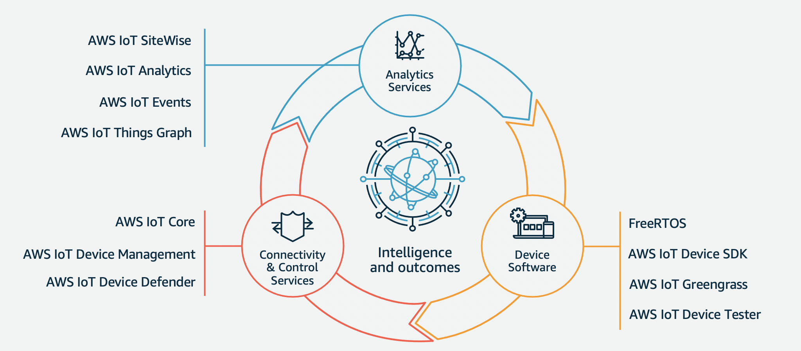

# AWS IoT Workshop

This technical workshop is designed to provide architects and developers hands-on training for designing Internet of Things (IoT) applications using AWS IoT services.

You will explore some of the amazing AWS IoT services from our Virtuous Cycle.

